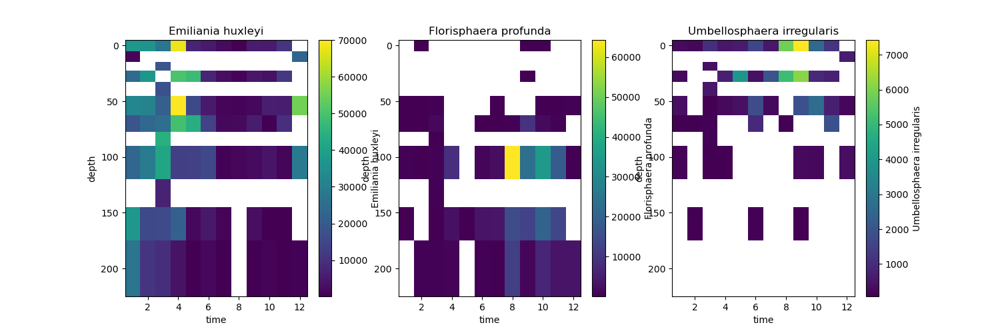
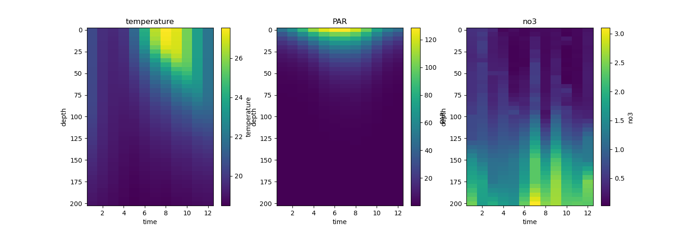
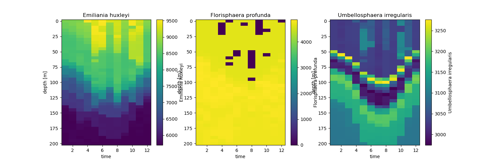

2-phase Ensemble 
****************

YAML example
~~~~~~~~~~~~

Before running the model, model specifications need to be defined in a YAML file. 
For a detailed explanation of each parameter see :ref:`yaml_config`.

The YAML file of a 2-phase model used in this example is provided below.
Note that compared to a 1-phase regressor model, the hyper-parameters for the classifier also need to be specified.

.. literalinclude:: ../../examples/2-phase.yml
   :language: yaml

Running the model
~~~~~~~~~~~~~~~~~
After specifying the model configuration in the relevant YAML file, we can use the Abil API
to 1) tune the model, evaluating the model performance across different hyper-parameter values and then 
selecting the best configuration 2) predict in-sample and out-of-sample observations based on the optimal
hyper-parameter configuration identified in the first step 3) conduct post-processing such as exporting
relevant performance metrics, spatially or temporally integrated target estimates, and diversity metrics.

Loading dependencies
^^^^^^^^^^^^^^^^^^^^

Before running the Python script we need to import all relevant Python packages.
For instructions on how to install these packages, see `requirements.txt <../../../../../requirements.txt>`_
and the Abil :ref:`getting-started`.

.. literalinclude:: ../../examples/2-phase.py
   :lines: 4-11
   :language: python

Loading the configuration YAML
^^^^^^^^^^^^^^^^^^^^^^^^^^^^^^
.. literalinclude:: ../../examples/2-phase.py
   :lines: 15-16
   :language: python

Loading training data
^^^^^^^^^^^^^^^^^^^^^

In this example we will look at coccolithophore observations from the Bermuda Atlantic Time Series (`BATS <https://bios.asu.edu/bats>`_).
These observations were extracted from the `CASCADE database <https://doi.org/10.5281/zenodo.12797197>`_ and combined with environmental data from `World Ocean Atlas <https://www.ncei.noaa.gov/products/world-ocean-atlas>`_ and irradiance data from `Castant et al., 2024 <https://doi.org/10.1016/j.rse.2024.114305>`_.

We will focus on the three key species found in this region: *Emiliania huxleyi*, *Florisphaera profunda* and *Umbellosphaera irregularis*.

.. literalinclude:: ../../examples/2-phase.py
   :lines: 18-26
   :language: python

Plotting observations
---------------------
To plot the observations and environmental data we create a re-usable function:

.. literalinclude:: ../../examples/2-phase.py
   :lines: 29-39
   :language: python

We then apply this function to the observations:

.. literalinclude:: ../../examples/2-phase.py
   :lines: 41-42
   :language: python

And the environmental data:

.. literalinclude:: ../../examples/2-phase.py
   :lines: 46-47
   :language: python

Training the model and making predictions
^^^^^^^^^^^^^^^^^^^^^^^^^^^^^^^^^^^^^^^^^^

Next we train our model. The syntax here is the same as used in the :ref:`one-phase-ensemble`. 
However, as we are applying the pipeline to three different species we will wrap it in a function and then loop over each species:

.. literalinclude:: ../../examples/2-phase.py
   :lines: 51-70
   :language: python

Post-processing
^^^^^^^^^^^^^^^
Afterwards we run post processing to combine all the predictions into one dataset:
.. literalinclude:: ../../examples/2-phase.py
   :lines: 71-75
   :language: python

Plotting predictions
---------------------
Now we can load the model output and plot it:
.. literalinclude:: ../../examples/2-phase.py
   :lines: 78-79
   :language: python

